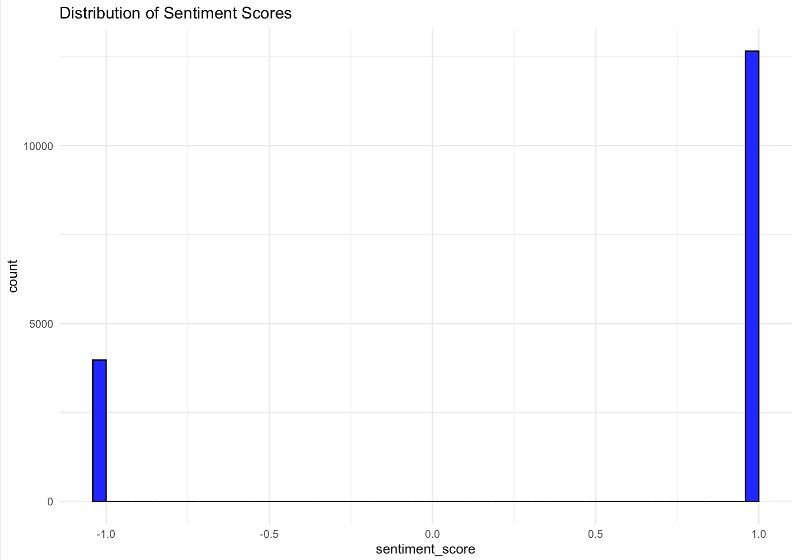
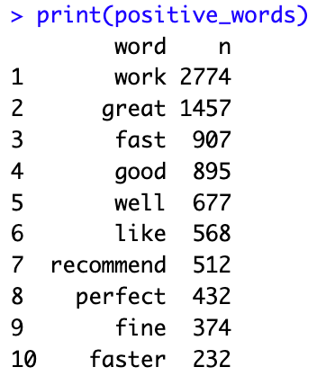
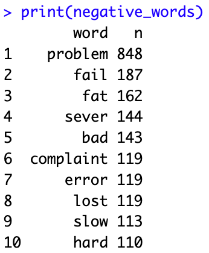
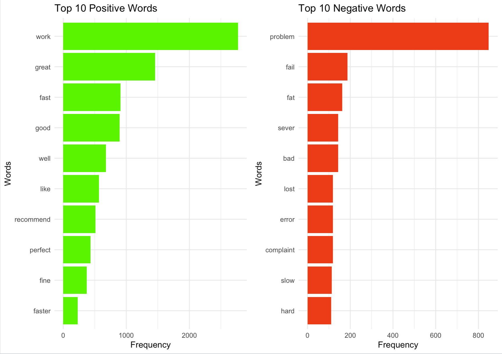

# Sentiment Analysis of Amazon Reviews on an Electrical Product

# About

This project conducts sentiment analysis on just under 5000 Amazom prodcuct reviews. The structure is designed to enable a user to easily swap out datasets of a similar structure to conduct sentiment analysis on reviews of any kind.

The dataset was downloaded from Kaggle, it is free to use and publically available.

Skills Showcased

-   Natural Language Processing - Sentiment Analysis
-   Data Cleaning
-   Data Preprocessing
-   Stemming

[View more projects like this!](https://jeff-bow.github.io/)

# Libraries Overview

The following R libraries will be used for this project:

``` r
library(tidyverse)
library(tidytext)
library(tm)
library(dplyr)
library(ggplot2)
library(gridExtra)
```

# Preparing the Data

Before applying the sentiment analysis modelthe dataset needs to be prepared. First, we will remove NA or blank data from the dataset.

``` r
reviews <- reviews %>%
  rename(reviews = reviewText) %>%
  # Removing rows with blank data in the reviewText (now reviews) columns as these are useless
  filter(!is.na(reviews))
```

# Preprocessing and Stemming Steps

In order to avoid repetition in our output of words such as 'work' ('works', 'worked') we can apply stemming to reduce all words to their basic form. We do this by creating a corpus of the column that contains the text of the review.

We then add in the transformations to this text column to further remove redundant data.

``` r
# Converting the reviews column into a corpus
reviews_corpus <- VCorpus(VectorSource(reviews$reviews))

# Applying text transformations: convert to lowercase, remove punctuation, remove numbers, stem
reviews_corpus <- tm_map(reviews_corpus, content_transformer(tolower))
reviews_corpus <- tm_map(reviews_corpus, removePunctuation)
reviews_corpus <- tm_map(reviews_corpus, removeNumbers)
reviews_corpus <- tm_map(reviews_corpus, stemDocument)
```

We can then breifly check the distribution of sentiment scores. From image we can see that there are nearly three times as many positive sentiments compared to negative. Further analysis is needed to gain a better understanding.



After stemming, we can tokenise the words to individualise them and understand how frequently they occur in the reviews. We will then split this with positive and negative sentiments. Using the bing lexicon allows us to categorize words based on sentiment. 

``` r
# Tokenizing the words and creating an inner join with the 'bing' lexicon
reviews_sentiment <- reviews %>%
  unnest_tokens(word, reviews) %>%
  inner_join(get_sentiments("bing"), by = "word")
```

# Data Output

Once we complete these steps we can start to draw analysis from the dataset. We can first look at the top 10 positive and negative words. It is important to note that due to stemming, words such as 'failure' are also counted in the 'fail' row in the top 10 negative sentiments

 

Having prepared the data we can begin to create simple visuals using the ggplot library. The visual created is a side by side comparison of the top 10 positive and top 10 negative words used in the reviews, and the frequency in which they occur. 

We can see that the word 'work' which counts 'works', 'worked', and 'working' along with others, is the most frequently used positive sentiment. We can also see that for this particular product, there are far more positive than negative reviews.



I like this project as I believe it could be quite useful. Although it is simple, a user could take review data from movies, restaurants, or cars and apply the same code by swapping out the source data. 
